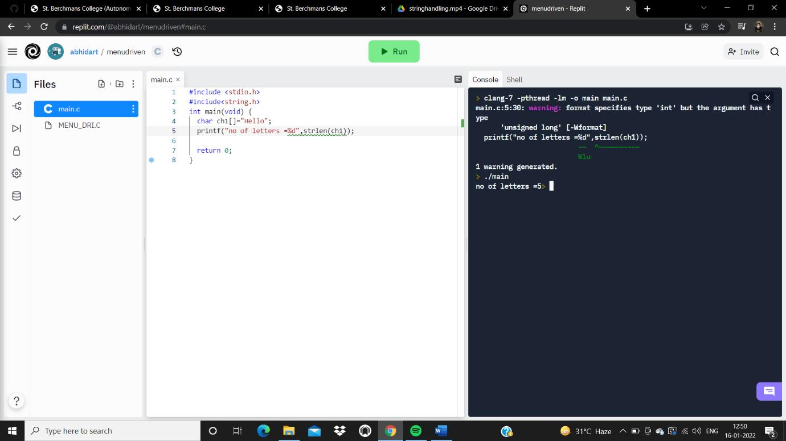
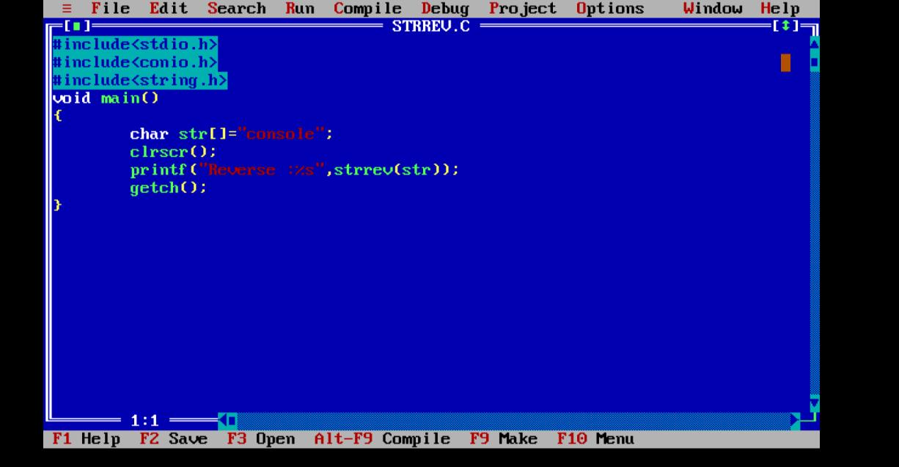
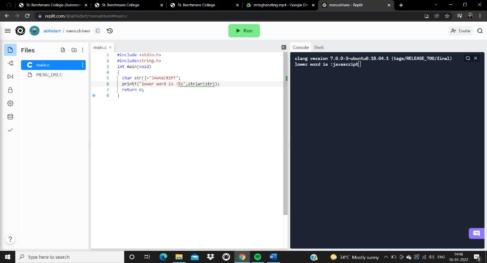
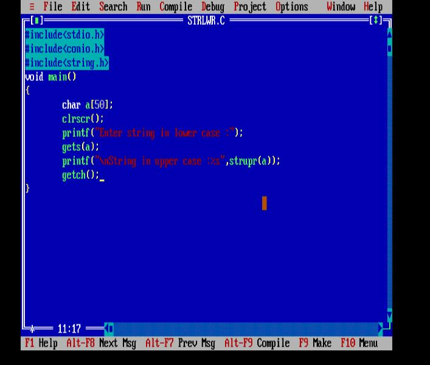
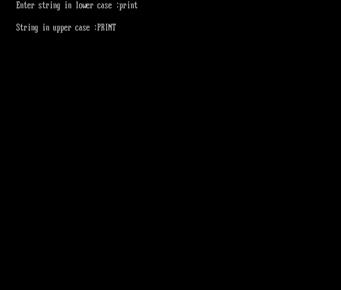
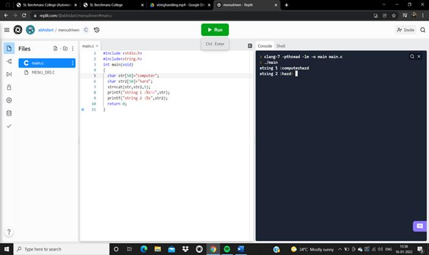
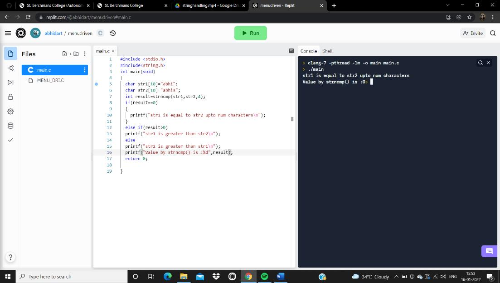
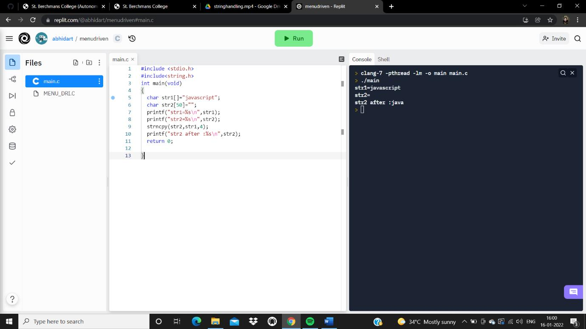

# **STRING HANDLING FUNCTIONS IN C**

# What are strings?

A string is a datatype used in c programming, such as an integer and floating point unit, but it is used to represent text rather than numbers. It is comprised of a set of characters that can also contain spaces and numbers. The length of a string is often determined by using a null character.

- C language supports a large number of string handling functions that can be used to carry out many of the string manipulations.

- These functions are packaged in string.h library.

- Hence we must include string.h header file in our programs to use these functions.

THERE ARE 18 TYPES OF STRING HANDLING FUNCTION.

IN THIS ASSIGNMENT THERE ARE 12 FUNCTIONS BECAUSE THEY ARE THE MAJOR FUNCTIONS IN STRING.

# 1. **strlen()**

This function is used to show the length of a string.

# 2. **strrev()**

This function is used to show the reverse of a string.

OUTPUT : Reverse :elosnoc

# 3. **strcpy()**

This string function copies one string into another.

# 4. **strcmp()**

This function is used to compare two strings.

# 5. **strlwr()**

This function is used to convert the given input to lowercase.

# 6. **strupr()**

This function is used to convert the given input to upper case letter.

# 7. **strcmpi()**

This function is same to strcmp, but stcmpi negotiates case &quot;A&quot; and &quot;a&quot; are treated as same.

OUTPUT The return function is :0

# 8. **strncat()**

Used to combine n characters of second string to first string.

# 9. **strncmp()**

Used to compare n characters of second string to first string.

# 10. **strncpy()**

Copies given number of characters of one string to another.

# 11. **strstr()**

This function returns pointer to first occurrence of str2 and str1.

# 12. **strcat()**

This string function is used to combine two strings.

